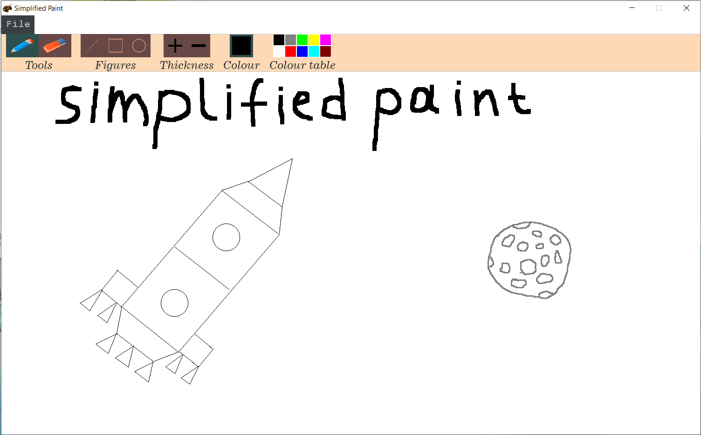

    

## Overview
The project is a simplified Paint.

## Features
- ⚙️ Menu that is read from a text file
- 🎨 Color selection option
- ✏ Possibility to use a pencil with the change of its size
- ⌫ Possibility to use an eraser with the change of its size
- ⚙️ Use of figures (line, rectangle, circle) with the change of their border thickness
- 🔍 Canvas scaling
- 🖼️ Canvas screenshot (with the ability to open this screenshot and continue editing it as in Paint)
- ⚙️ A simple graphical user interface like in Paint

## Dependencies
- [C++17](https://en.cppreference.com/w/cpp/17)
- [SDL2](https://www.libsdl.org/download-2.0.php), [SDL2_image](https://www.libsdl.org/projects/SDL_image/) and [SDL2_ttf](https://github.com/libsdl-org/SDL_ttf)
- [FreeType](https://gitlab.freedesktop.org/freetype/freetype)
- Simple File Dialog ([SFD](https://github.com/rxi/sfd)) library

## Building (for Windows)
Run an auxiliary script from the command line to automatically run the necessary [CMake](https://cmake.org/install/)
commands using the `.\build.sh` command, while in the directory with the root `CMakeLists.txt` file 
(the root project folder). Then an exe file with all necessary dlls will appear in the `build` folder.
